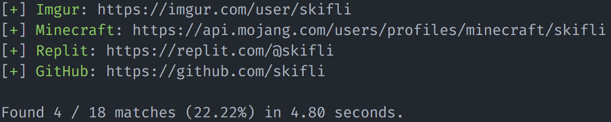

# watson

[](https://goreportcard.com/report/github.com/skifli/watson)

[](https://github.com/skifli/watson/releases)

- [watson](#watson)
  - [Installation](#installation)
    - [Using pre-built binaries](#using-pre-built-binaries)
    - [Running from source](#running-from-source)
  - [Usage](#usage)
    - [One Username](#one-username)
    - [Multiple Usernames](#multiple-usernames)

[](assets/cover.png)

watson allows you to easily search for social media accounts across a multitude of platforms.

## Installation

### Using pre-built binaries

Pre-built binaries are made available for every `x.x` release. If you want more frequent updates, then [run from source](#running-from-source). Download the binary for your OS from the [latest release](https://github.com/skifli/watson/releases/latest). There are quick links at the top of every release for popular OSes.

> [!NOTE]  
> If you are on **Linux or macOS**, you may have to execute **`chmod +x path_to_binary`** in a shell to be able to run the binary.

### Running from source

Use this method if none of the pre-built binaries work on your system, or if you want more frequent updates. It is possible that your system's architecture is different to the one that the binaries were compiled for **(AMD)**.

> [!TIP]  
> You can check your system's architecture by viewing the value of the **`GOHOSTARCH`** environment variable.

* Make sure you have [Go](https://go.dev) installed and is in your system environment variables as **`go`**. If you do not have go installed, you can install it from [here](https://go.dev/dl/).
* Download and extract the repository from [here](https://github.com/skifli/watson/archive/refs/heads/master.zip). Alternatively, you can clone the repository with [Git](https://git-scm.com/) by running `git clone https://github.com/skifli/watson` in a terminal.
* Navigate into the `/src` directory of your clone of this repository.
* Run the command `go build watson.go`.
* The compiled binary is in the same folder, named `watson.exe` if you are on Windows, else `watson`.

## Usage

```
Usage: watson.exe [--colourless] [--outputfolder OUTPUTFOLDER] [--showall] [--readtimeout READTIMEOUT] [--reqsperthread REQSPERTHREAD] [--sites SITES] [--usernames USERNAMES] [--version] [--writetimeout WRITETIMEOUT] [USERNAME]

Positional arguments:
  USERNAME               The username to check for.

Options:
  --colourless           Disables coloured output. [default: false]
  --outputfolder OUTPUTFOLDER
                         Folder name in which to dump outputs to. Files will be named according to the account's username. Set to an empty string to disable. [default: results]
  --showall              Show all sites, even ones which matches are not found for. Also applies to the output file. [default: false]
  --readtimeout READTIMEOUT
                         Timeout for reading request response (in milliseconds). Could slow the program down more, if coupled with a higher 'reqsperthread' value. [default: 1000]
  --reqsperthread REQSPERTHREAD
                         The amount of requests per thread. Can significantly increase or decrease speed. [default: 3]
  --sites SITES          JSON file to load data from a. Can be local or a URL. [default: https://raw.githubusercontent.com/skifli/watson/main/src/sites.json]
  --usernames USERNAMES
                         Used to check for multiple usernames. Has a high precedence than 'username'.
  --version              Display the current version of the program and exit.
  --writetimeout WRITETIMEOUT
                         Timeout for writing request (in milliseconds). [default: 1000]
  --help, -h             display this help and exit
```

### One Username

```
watson.exe skifli
```

### Multiple Usernames

```
watson.exe --usernames "skifli" "skiflee"
```
